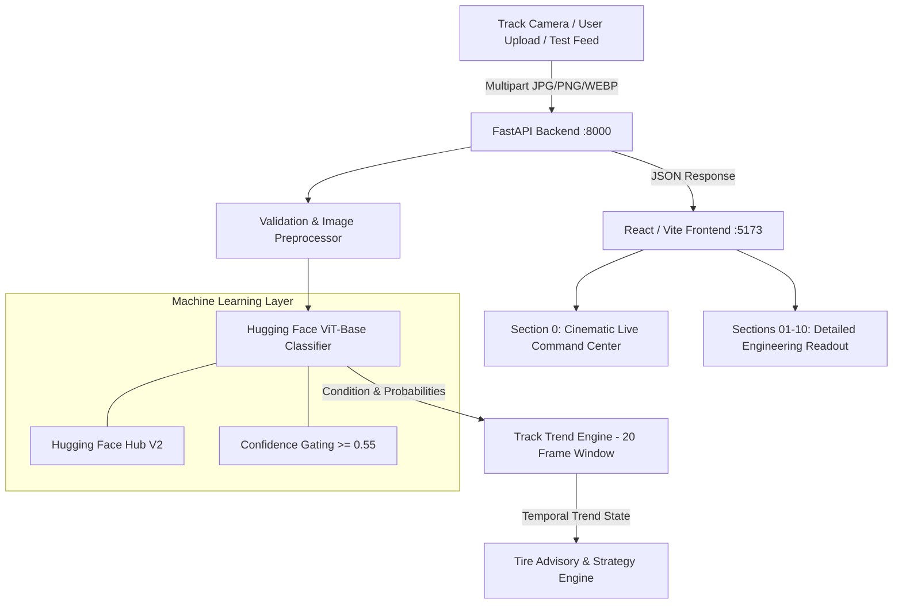
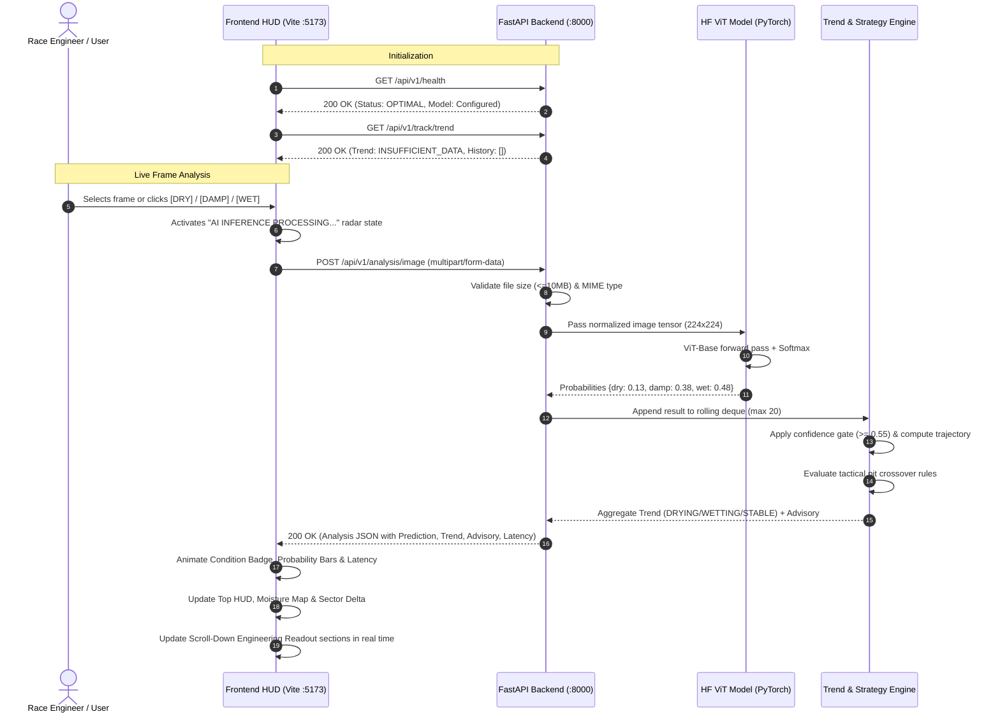

# APEXTRACK AI — COMPLETE SYSTEM ARCHITECTURE, WORKFLOW & FEATURE DOCUMENTATION

**Project**: ApexTrack AI — Live Track Condition Intelligence  
**Version**: 2.0.0 (Production Release)  
**Author / Team**: ApexTrack Engineering Team  
**Model Hub**: [yuvrajengines/apextrack-track-condition-v2](https://huggingface.co/yuvrajengines/apextrack-track-condition-v2)  

---

## 1. Executive Summary & Architecture Overview

**ApexTrack AI** is an advanced motorsport computer vision and live track-condition intelligence platform designed for race engineers, strategists, and simulation environments. It transforms visual track feeds into real-time condition classifications (`DRY`, `DAMP`, `WET`), computes temporal condition trends (`DRYING ↘`, `WETTING ↗`, `STABLE →`), and provides tactical race decision support for optimal tire crossover pit windows.

### High-Level System Architecture



---

## 2. Technology Stack

| Layer | Technologies Used | Responsibility |
| :--- | :--- | :--- |
| **Frontend UI/UX** | React 18, TypeScript, Vite, TailwindCSS, Custom Glassmorphism CSS | Fullscreen motorsport HUD, hero racing video, dynamic scan overlays, interactive drag-and-drop, full-length engineering readout. |
| **Backend API** | FastAPI, Python 3.12, Uvicorn, Pydantic v2, HTTPX | High-concurrency async REST API, multipart file validation, health checks, temporal trend aggregation, CORS management. |
| **Machine Learning** | Hugging Face Transformers, PyTorch, PIL, ViT-Base | Vision Transformer image classification (`dry`, `damp`, `wet`), confidence scoring, softmax probability distribution. |
| **Model Hosting** | Hugging Face Hub (`yuvrajengines/apextrack-track-condition-v2`) | Fine-tuned Vision Transformer repository with automated download and local caching fallback. |
| **Testing & CI** | Pytest, AnyIO, Starlette TestClient | 23 automated unit and integration tests covering image validation, model inference, trend rules, and API endpoints. |

---

## 3. End-to-End System Workflow



---

## 4. Complete Feature Matrix

### 1. Section 0 — Live Command Center (Fullscreen Hero HUD)
- **Cinematic Looping Video Hero**: Seamless background video (`apextrack-track.mp4`) with scanlines and dark vignette.
- **Turn 12 Tactical Radar Card**: Real-time corner metrics displaying Apex Speed (`245 KM/H`), Entry Speed (`198 KM/H`), Gear (`6`), and animated corner silhouette.
- **Surface Mesh Grid Scanners**: Left kerb scanner (Amber grid) and track surface scanner (Cyan grid).
- **Cockpit Radar Arc & Reticle**: Target tracking box with distance measurement (`12.6 m`) and cockpit radar reticle.
- **Drag-and-Drop Ingestion**: Interactive dropzone with preview thumbnail, frame replacement, and quick 1-click test triggers (`DRY`, `DAMP`, `WET`).
- **4-Corner Telemetry Cluster**: Tire pressure & temperature matrix with chassis wireframe, throttle/brake gauges, digital circular speedometer (`245 KM/H`), engine RPM (`11,245`), and ERS deployment (`73%`).

### 2. Scroll-Down Engineering Readout (Sections 01 – 10)
- **Section 01 // Track Condition Analysis**: Large state display (`WET` / `DAMP` / `DRY`), confidence percentage, horizontal probability distribution bars, and latency.
- **Section 02 // Temporal Track Analysis**: Dynamic trend state (`DRYING ↘`, `WETTING ↗`, `STABLE →`), confidence gating status (`≥ 0.55`), and chronological telemetry sequence.
- **Section 03 // AI Decision Support & Race Strategy**: Tactical state (`DELTA ACTIVE`), lap delta (`-0.236 s`), tactical AI advisory text, recommended action, and severity badge.
- **Section 04 // Vehicle Telemetry Console**: Speed, RPM, Throttle, Brake, ERS Deploy, Fuel Load (`36.7 LAPS`), Lap Time, and Delta.
- **Section 05 // Tyre & Chassis Condition**: 4-wheel tire pressures, temperatures, and degradation percentages (`FL: 12%`, `FR: 13%`, `RL: 11%`, `RR: 11%`).
- **Section 06 // Track Surface Analysis**: Asphalt material, Grip Level (`0.42 [MEDIUM]`), Surface Temperature (`28.4°C`), Irregularities (`2.1%`), and DRS detection.
- **Section 07 // Object Detection Radar**: Live radar counts for Race Car, Marshals, Debris, and Track Limits.
- **Section 08 // AI Model Diagnostics**: ViT-Base architecture specifications, Hugging Face Hub metadata, inference latency, and connection status.
- **Section 09 // System Health Microservices**: Status checklist for Frontend, FastAPI, ML Model Engine, Hugging Face Hub, Image Inference, Trend Engine, and Advisory Engine.
- **Section 10 // Platform Capabilities**: Architectural summary of vision intelligence, temporal analysis, and tactical pit support.

---

## 5. Backend REST API Reference

Base URL: `http://localhost:8000` (or configurable via `VITE_API_BASE_URL`)

### 1. Health & Model Diagnostic
- **Endpoint**: `GET /api/v1/health`
- **Response `200 OK`**:
```json
{
  "status": "healthy",
  "service": "ApexTrack AI API",
  "version": "1.0.0",
  "model": {
    "configured": true,
    "provider": "huggingface",
    "model_id": "yuvrajengines/apextrack-track-condition-v2"
  }
}
```

### 2. Track Image Analysis
- **Endpoint**: `POST /api/v1/analysis/image`
- **Content-Type**: `multipart/form-data`
- **Parameters**: `file` (Binary JPG, PNG, WEBP $\le$ 10MB)
- **Response `200 OK`**:
```json
{
  "analysis_id": "8e4d5831-9605-4616-b407-51e4d34d99e1",
  "timestamp": "2026-08-15T11:47:10.118595Z",
  "prediction": {
    "condition": "wet",
    "confidence": 0.4824,
    "probabilities": {
      "dry": 0.1336,
      "damp": 0.3840,
      "wet": 0.4824
    }
  },
  "processing_time_ms": 458.19,
  "model": {
    "provider": "huggingface",
    "model_id": "yuvrajengines/apextrack-track-condition-v2"
  },
  "trend": "drying",
  "advisory": {
    "severity": "medium",
    "message": "Track surface is drying rapidly. Crossover window approaching in 2-3 laps.",
    "recommended_action": "Prepare intermediate/dry tire sets in pit lane."
  }
}
```

### 3. Track Trend & Rolling History
- **Endpoint**: `GET /api/v1/track/trend`
- **Response `200 OK`**:
```json
{
  "history": [
    { "timestamp": "2026-08-15T11:45:00Z", "condition": "wet", "confidence": 0.88 },
    { "timestamp": "2026-08-15T11:46:00Z", "condition": "damp", "confidence": 0.74 },
    { "timestamp": "2026-08-15T11:47:00Z", "condition": "dry", "confidence": 0.65 }
  ],
  "trend": "drying",
  "advisory": {
    "severity": "medium",
    "message": "Track surface is drying rapidly. Crossover window approaching in 2-3 laps.",
    "recommended_action": "Prepare intermediate/dry tire sets in pit lane."
  }
}
```

---

## 6. Machine Learning Model Specifications

- **Base Architecture**: Vision Transformer (`google/vit-base-patch16-224-in21k`)
- **Dataset Repository**: [`yuvrajengines/apextrack-track-condition-dataset`](https://huggingface.co/datasets/yuvrajengines/apextrack-track-condition-dataset) (300 balanced training images: 100 Dry, 100 Damp, 100 Wet; 27 Validation; 32 Test)
- **Output Classes & ID Mapping**:
  - `0`: `damp`
  - `1`: `dry`
  - `2`: `wet`
- **Hugging Face Model Repository**: [`yuvrajengines/apextrack-track-condition-v2`](https://huggingface.co/yuvrajengines/apextrack-track-condition-v2)
- **Inference Optimization**: Singleton model loader with automatic Hugging Face Hub download, validation caching, and PyTorch CPU/GPU inference.

---

## 7. Step-by-Step Setup & Run Guide

### Prerequisites
- Python 3.10+
- Node.js 18+ and npm

### 1. Running the FastAPI Backend
```powershell
# Navigate to the backend directory
cd backend

# Run the FastAPI server (runs on port 8000)
python run.py
```
> **Note**: The backend loads the production Vision Transformer model directly from Hugging Face Hub.

### 2. Running the Frontend
```powershell
# In a second terminal, navigate to the frontend directory
cd frontend

# Start the Vite development server
npm run dev
```

### 3. Verification & Access
- Open **`http://localhost:5173`** in your browser.
- Open **`http://localhost:8000/docs`** for interactive Swagger API documentation.

---

## 8. Common Troubleshooting Guide

| Issue | Root Cause | Solution |
| :--- | :--- | :--- |
| **"Unable to connect to remote server"** | Backend is not started or running in wrong folder. | Ensure you are in `race/backend` and run `python run.py`. |
| **"Port 8000 already in use"** | Multiple uvicorn instances running. | Close background Python processes or check port with `Get-NetTCPConnection -LocalPort 8000`. |
| **Navigation bar doesn't jump** | Fixed header offset overlap. | Resolved using `scroll-mt-16` on section elements and smooth-scroll script in `ApexTrackShell.tsx`. |
| **Page cannot scroll** | `overflow: hidden` on body or `#root`. | Resolved in `index.css` with `overflow-y: auto; overflow-x: hidden`. |
